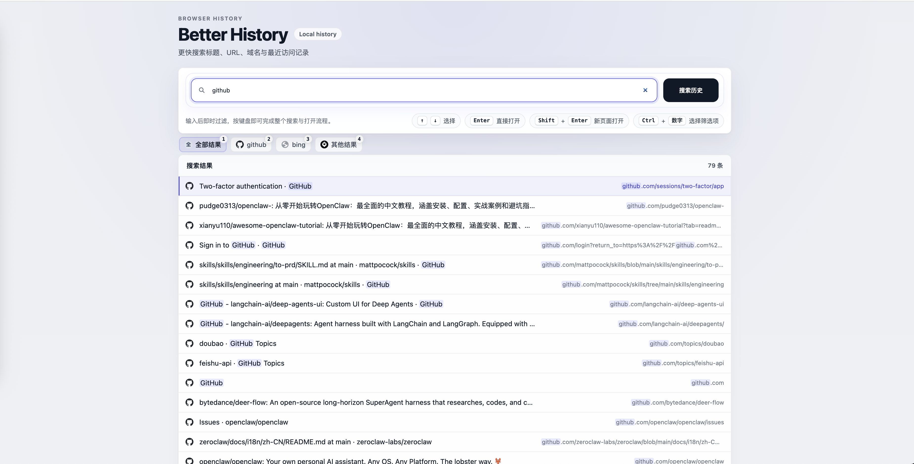

# Better History


一个面向键盘优先用户的 Chrome Manifest V3 历史搜索扩展。

它不走浏览器原生历史页，也不依赖 `omnibox` 关键词模式，而是提供一个独立的命令面板式历史搜索页：默认展示最近访问记录；输入关键词后，再按站点 icon 来源自动聚集结果，配合键盘导航、快速筛选和稳定焦点管理，尽量把“找回刚看过的页面”这件事做得更快。

## Demo



## Why Better History

浏览器自带历史页能查到内容，但不一定适合高频检索。这个项目更关注下面几件事：

- 更快进入：点击扩展图标即可打开独立搜索页，也支持扩展级快捷键直接唤出
- 更好识别：搜索后按 favicon 来源近似聚类，减少你在相似结果里来回扫视
- 更少干扰：高密度列表、稳定焦点、键盘优先，不把注意力浪费在多余切换上
- 更贴近真实工作流：支持当前页打开、新标签打开、站点定向搜索和快捷筛选

## 适合谁

- 经常需要从大量浏览记录里找回某个页面的人
- 偏好键盘驱动、命令面板式交互的用户
- 希望替代原生历史页模糊查找体验的 Chrome / Chromium 用户

## 核心特性

- 独立扩展页面作为主入口，不再依赖 `omnibox`
- 搜索覆盖标题与 URL，排序规则为“标题命中优先 > 最近访问时间 > 访问次数 > URL”
- 多个空格分隔关键词默认按 AND 语义匹配，例如 `aa bb` 会查找同时命中 `aa` 与 `bb` 的结果，并分别高亮每个词
- 同一域名下若标题相同，仅保留一个代表结果
- 输入搜索词后，结果会按相同 icon 来源自动聚集排序；实现上采用站点级 favicon 来源做低成本近似
- 支持在设置面板中维护域名优先级列表；命中的优先域名会被强制提升为独立分组，并按自定义顺序显示在前
- 支持 `site:domain` / `domain:domain` 显式站点定向搜索
- 页面初次打开且输入为空时，会先展示最近访问的 20 条去重记录，并按上次访问时间倒序排列
- 结果区会固定显示轻量头部，用 `最近访问 / 搜索结果 + 条数` 建立上下文
- 支持键盘结果导航：`ArrowUp` / `ArrowDown` 选择，`Enter` 当前页打开，`Shift+Enter` 新标签打开
- 支持 `Ctrl + 数字键` 快速切换站点筛选；按住 `Ctrl` 时会临时显示数字提示，不影响 chip 宽度
- 键盘选中切换与 `Ctrl` 快捷提示优先使用局部 DOM 更新，减少连续操作时的整表重绘
- 鼠标点击结果不会抢走输入框焦点；切回搜索页时输入框会自动恢复焦点
- 图标优先使用 Chrome 官方 `_favicon` 能力，失败时回退到稳定占位图标
- 在召回阶段和结果整理阶段双重过滤 `doubao://history`、`chrome://*`、`chrome-extension://*`，以及 `extensions?id=...` 这类无协议内部页结果，避免污染搜索结果
- 对相同查询结果和补召回批次做短时缓存，减少连续输入时的重复历史查询

## 交互亮点

- 搜索页头部采用三层结构：产品分类 eyebrow、`Better History` 主标题和一句话价值说明
- 搜索区继续向 `Linear` 风格收敛，强调更轻的阴影、更清晰的边界和更中性的背景
- 输入区融合 `Raycast` 式命令面板表达，让“输入即过滤”成为页面主工作流
- 搜索框下方把核心快捷键整理为独立提示标签，降低阅读负担
- 当前筛选结果数不再占用独立状态栏，而是收敛到结果头部与列表本身
- 键盘滚动策略更克制，只有选中项接近可视区上下边界时才自动滚动

## 快速开始

### 安装

1. 克隆仓库到本地：

```bash
git clone https://github.com/zhangqibupt/better-history.git
cd better-history
```

2. 打开 Chrome 或兼容 Chromium 的扩展管理页：`chrome://extensions`
3. 开启“开发者模式”
4. 点击“加载已解压的扩展程序”
5. 选择当前仓库根目录

### 使用

1. 点击浏览器工具栏中的扩展图标，或直接使用扩展快捷键打开搜索页
2. 页面默认展示最近访问的 20 条去重记录，并按上次访问时间倒序排列
3. 输入关键词开始搜索，例如 `chrome`
4. 输入多个关键词时默认按 AND 匹配，例如 `aa bb`
5. 如果只想查看某个站点，可输入 `lrm site:larkoffice.com`
6. 当搜索结果形成多个可解释分组时，结果区上方会出现站点快捷筛选条
7. 点击搜索框右侧的“设置”，可维护域名优先级列表；保存后会在下次打开页面时自动恢复
8. 若搜索结果命中了你配置的优先域名，即使该域名只出现 1 条结果，也会被提升为独立分组并排到前面
9. 使用 `ArrowUp` / `ArrowDown` 选择结果
10. 按 `Enter` 在当前标签页打开结果
11. 按 `Shift+Enter` 或直接鼠标点击任意结果，在新标签页打开目标页面

### 快捷键

- `ArrowUp` / `ArrowDown`：切换当前选中结果
- `Enter`：在当前标签页打开选中结果
- `Shift+Enter`：在新标签页打开选中结果
- `Ctrl + 数字键`：切换站点快捷筛选
- `Escape`：关闭设置面板
- `Cmd + Shift + E`：macOS 默认扩展快捷键
- `Ctrl + Shift + E`：Windows / Linux 默认扩展快捷键

如果默认快捷键未生效，或与本机已有快捷键冲突，可以在 `chrome://extensions/shortcuts` 中修改 `Better History` 的命令绑定。

## 品牌与图标

- 品牌 logo 使用“搜索镜 + 时钟”的组合图形表达高效历史检索
- 设计目标是在 Chrome 工具栏 16px 小尺寸下仍能快速传达“搜索历史”的语义
- 图形主体是放大镜，镜片内部的钟表指针表达 `History`，手柄末端的轻微箭头补充“快速跳转 / 导航”的感觉
- 视觉风格延续搜索页现有的 indigo 主色，并用高对比白色图形保证小尺寸可读性
- 矢量源文件位于 `assets/logo.svg`
- 导出的扩展图标位于 `assets/icon-16.png`、`assets/icon-32.png`、`assets/icon-48.png`、`assets/icon-128.png`
- `manifest.json` 已声明 `icons` 与 `action.default_icon`

如果后续你想继续迭代 logo，建议只修改 `assets/logo.svg`，再用 macOS 自带的 `sips` 重新导出各尺寸 PNG：

```bash
for size in 16 32 48 128; do
  sips -s format png -z "$size" "$size" assets/logo.svg --out "assets/icon-${size}.png"
done
```

## 开发与测试

安装依赖后，运行测试：

```bash
npm test
```

当前测试覆盖的核心逻辑包括：

- 查询解析
- 标题与 URL 匹配
- 排序
- 域名优先级校验、去重与分组重排
- 域名筛选
- 同域名同标题去重
- 站点分组策略
- 站点快捷筛选模型
- 设置持久化恢复
- 键盘选择索引边界
- 当前标签页 / 新标签页两种打开路径

如果你在排查内部页过滤问题，可打开扩展页 DevTools，在 Console 中按下面顺序操作：

```js
window.__BETTER_HISTORY_DEBUG_ENABLED__ = true
window.__BETTER_HISTORY_BUILD__
window.__BETTER_HISTORY_DEBUG__
```

其中 `__BETTER_HISTORY_DEBUG__` 会在显式开启 `__BETTER_HISTORY_DEBUG_ENABLED__` 后，包含最近一次搜索的原始结果数、过滤后结果数，以及被剔除项的 `title/url` 快照。默认不开启，避免在正常搜索路径里持续构造调试日志。

如果你修改了扩展源码但浏览器页面仍表现异常，请回到扩展管理页重新加载该扩展，再重新打开搜索页，避免继续运行旧缓存脚本。

## 权限与实现边界

- `history`：用于读取浏览历史记录
- `favicon`：用于通过 Chrome 官方 `_favicon` 资源获取更接近原生历史页的站点图标
- 当前主入口是扩展图标点击后打开的独立页面
- 扩展也通过 `commands` 提供快捷键入口，两种入口并存
- 当前不再支持 `hs <keyword>` 这类地址栏模式
- 搜索优先使用 `chrome.history.search(query)` 做原生粗召回；多词搜索时会优先用最长 token 做主召回，再配合受控补召回和本地 AND 过滤
- 为了降低连续输入时的重复 IO，相同查询结果与补召回批次会做短时缓存，但不会改变既有过滤、分组和排序规则
- 搜索结果会在历史召回后立即剔除浏览器内部页与扩展页，例如 `chrome://newtab/`、`chrome://extensions/`、扩展自身页面，以及部分浏览器历史里以 `extensions?id=...` 形式出现的无协议内部页
- 结果图标优先复用 `_favicon`，若不可用则回退到稳定的首字母占位图标
- 当前界面优先追求高密度检索体验，因此分组默认自动展开，不引入额外视图切换

## 已知限制

- 当前仍然依赖 favicon 来源做近似聚类，因此分组语义是“足够好用”的工程折中，而不是严格站点知识图谱
- 默认快捷键可能受到浏览器策略、系统快捷键或其他扩展冲突影响
- 目前仓库优先打磨 GitHub 开源体验，尚未包含 Chrome Web Store 上架相关资产与流程

## Roadmap

- 补齐 `LICENSE`、`CONTRIBUTING.md`、`CHANGELOG.md`
- 补齐 GitHub Issue / PR 模板与最小 CI
- 增加更多适合 GitHub 首页展示的截图或演示 GIF
- 继续优化 README、About 和 Topics，使仓库表达更适合公开开源传播

## 参与贡献

欢迎通过 Issue 和 Pull Request 提出问题、反馈体验或贡献改进。

更多信息可参考：

- `LICENSE`
- `CONTRIBUTING.md`
- `CHANGELOG.md`
